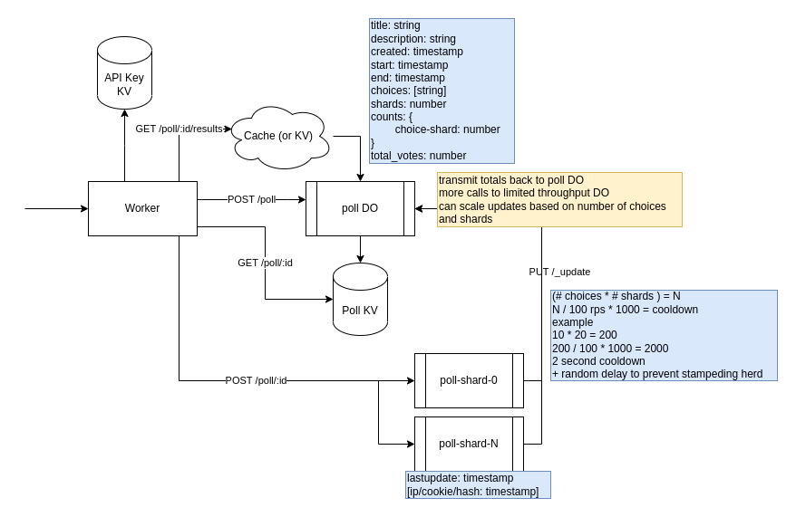

# edge-poll

## Design

## Components

### Worker
A stateless Cloudflare Worker that routes to a Poll DO or a Poll-Shard DO depending on the request path.

#### Endpoints
`POST /poll`
Creates a Poll, redirected to Poll DO.

`GET /poll/:id`
Gets a Poll configuration, redirect to KV.

`GET /poll/:id/results`
Gets the current results for a poll, hits the DO but will be cached. Redirected to Poll DO.

`DELETE /poll/:id`
Deletes a poll and purges all related DOs.

Sends a delete request to Poll DO and all Poll-Shard DOs.

`POST /poll/:id`
Submits a poll response, redirected to Poll-Shard DO.

### Poll Durable Object
A Durable Object that manages state for a Poll. 
It holds the config and aggregates updates from the Poll-Shard DOs.

Config/metadata reads will be redirected to a persistent KV store, but results/status reads will come from the DO and be cached temporarily.

#### Endpoints
`POST /`
Instantiates a Poll DO.

`GET /`
Returns config, normally this would come from KV.

Returns poll results from Poll-Shard DO updates.

`PUT /`
A Poll-Shard will submit a state update

`DELETE /`
Purges persistent storage.

### Poll-Shard Durable Object
A Durable Object that manages the state for a set of user ids in a poll. 
It will periodically report its state back to the main Poll DO.

It holds state for all possible choices but only for a subset of user ids.

#### Endpoints
`PUT /`
Check ip for duplicate vote, persist vote, send update to main Poll DO.

`DELETE /`
Purges persistent storage.

### Poll KV
Used as read heavy data store for Poll DO data. The Poll DO will be updated synchronously and publish changes to KV, but all reads will be from KV.

Override with `?cache=false` maybe?

### API Key KV
KV namespace to check for valid API keys.

## TODO

- [ ] use setTimeout to schedule shard update if skipped because of cooldown (use DO Alarms once they are GA)
- [ ] DELETE /poll/:id should send a delete request to Poll DO and all Poll-Shard DOs, and remove config from KV.
- [x] use cache instead of KV to get more recent results